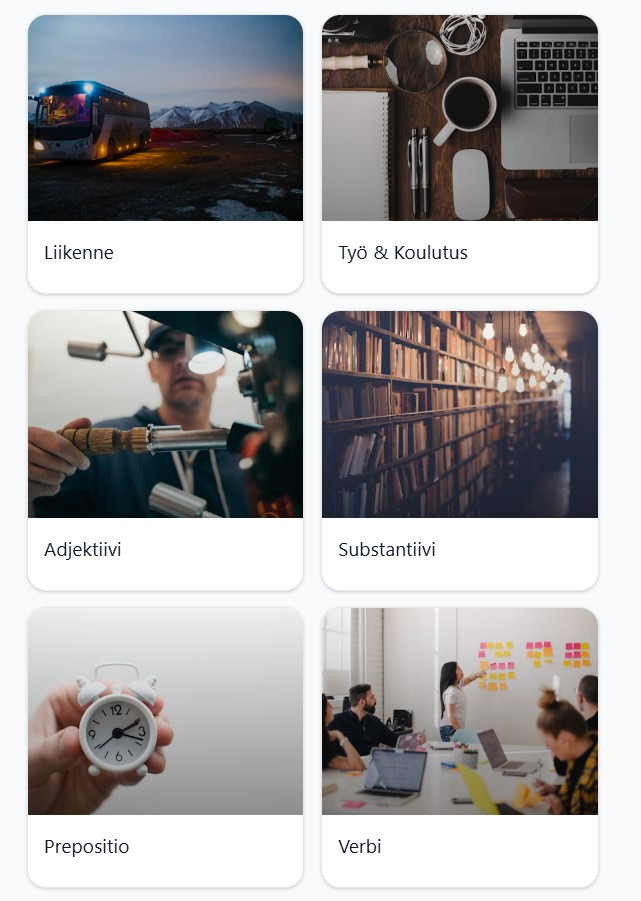

# Finnish Vocabulary Learning App

A modern React-based app for learning Finnish vocabulary with spaced repetition, Firebase integration, and bilingual support.

## Demo

Check out the app in action: [YouTube Demo](https://www.youtube.com/watch?v=Bcwf0F4_alA)

## Screenshots

<div style="display: grid; grid-template-columns: 1fr 1fr; gap: 20px; justify-items: center; align-items: start;">
  <div style="text-align: center;">
    
    <p><strong>Home Screen</strong></p>
  </div>
  <div style="text-align: center;">
    
    <p><strong>Categories View</strong></p>
  </div>
  <div style="display: flex; flex-direction: column; align-items: center; gap: 10px;">
    <div style="text-align: center;">
      
      <p><strong>Learning Activities</strong></p>
    </div>
    <div style="text-align: center;">
      
      <p><strong>Learning Activities 2</strong></p>
    </div>
  </div>
  <div style="text-align: center;">
    
    <p><strong>Sample Vocabulary Card</strong></p>
  </div>
</div>

## Getting Started

### Prerequisites

- Node.js (version 18 or higher)
- npm or yarn
- Firebase project with Firestore and Authentication enabled

### Installation

1. Clone the repository:

   ```bash
   git clone https://github.com/Janphan/Finnish-Vocabulary-Learning-App.git
   cd finnish-vocabulary-learning-app
   ```

2. Install dependencies:

   ```bash
   npm install
   ```

3. Set up Firebase:

   - Create a Firebase project at https://console.firebase.google.com/
   - Enable Firestore and Authentication (Google Sign-In)
   - Copy your Firebase config to a `.env` file in the root directory:
     ```
     VITE_FIREBASE_API_KEY=your_api_key
     VITE_FIREBASE_AUTH_DOMAIN=your_auth_domain
     VITE_FIREBASE_PROJECT_ID=your_project_id
     VITE_FIREBASE_STORAGE_BUCKET=your_storage_bucket
     VITE_FIREBASE_MESSAGING_SENDER_ID=your_sender_id
     VITE_FIREBASE_APP_ID=your_app_id
     VITE_FIREBASE_MEASUREMENT_ID=your_measurement_id
     ```

4. Start the development server:
   ```bash
   npm run dev
   ```

The app will be available at `http://localhost:5173`.

## Features

- **Bilingual Learning**: Finnish ↔ English vocabulary with contextual examples
- **Category-Based Organization**: Learn by semantic topics (Family, Food, Travel) and grammar categories (Nouns, Verbs, etc.)
- **Spaced Repetition System**: Basic review scheduling for vocabulary retention
- **Smart Vocabulary Cards**: Swipeable cards with pronunciation guides and part-of-speech information
- **User Authentication**: Google Sign-In for personalized learning
- **Favorites & Folders**: Save and organize personal vocabulary collections
- **Admin Vocabulary Management**: Edit and manage vocabulary database (admin only)
- **Responsive Design**: Works seamlessly on desktop and mobile devices
- **Firebase Integration**: Real-time data sync and user authentication

## Architecture

- **Frontend**: React 18 + TypeScript + Vite
- **Styling**: Tailwind CSS with custom animations and Montserrat font
- **Backend**: Firebase Firestore for data storage and user management
- **Authentication**: Firebase Auth with Google Sign-In
- **State Management**: React hooks and context for user authentication
- **Admin Features**: Role-based access for vocabulary management
- **Testing**: Vitest for unit tests and component testing

## Project Structure

```
src/
├── components/
│   ├── VocabularySwiper.tsx      # Main vocabulary display with SRS
│   ├── ReviewSession.tsx         # SRS review interface
│   ├── CategoryList.tsx          # Category navigation
│   ├── CategoriesView.tsx        # Categories overview
│   ├── FoldersView.tsx           # Folder management
│   ├── FolderView.tsx            # Individual folder view
│   ├── LearningView.tsx          # Learning interface
│   ├── PracticeView.tsx          # Practice interface
│   ├── ReviewView.tsx            # Review interface
│   ├── AddToFolderModal.tsx      # Add word to folder modal
│   ├── EditWordModal.tsx         # Edit word modal
│   ├── FolderManager.tsx         # Folder management component
│   └── figma/
│       └── ImageWithFallback.tsx # Image component with fallback
├── contexts/
│   └── AuthContext.tsx           # Authentication context
├── hooks/
│   ├── useAIVocabulary.ts        # AI-powered vocabulary generation
│   ├── useApiVocabulary.ts       # API vocabulary hook
│   ├── useApiVocabulary.test.ts  # Tests for API vocabulary hook
│   └── useFirestoreVocabulary.ts # Firebase data fetching with caching
├── PracticeGame/
│   └── PracticeQuiz.tsx          # Random practice quiz
├── services/
│   ├── aiService.ts              # AI processing service
│   ├── categoryService.ts        # Category management
│   ├── firebaseAuth.ts           # Firebase authentication
│   ├── firebaseConfig.ts         # Firebase configuration
│   ├── firebaseVocabulary.ts     # Firebase vocabulary operations
│   ├── firestore.ts              # Firestore utilities
│   ├── userService.ts            # User management
│   └── vocabularyService.ts      # Vocabulary service
├── types/
│   └── index.ts                  # TypeScript type definitions
├── utils/
│   ├── fallbackExamples.ts       # Fallback examples utility
│   ├── promptUtils.ts            # Prompt utilities
│   ├── session.ts                # Session management
│   ├── srsLogic.test.ts          # SRS logic unit tests
│   ├── srsLogic.ts               # SRS algorithm logic
│   └── translations.ts           # Translation utilities
├── App.tsx                       # Main app component
├── firebase.ts                   # Firebase initialization
├── index.css                     # Global styles
├── main.tsx                      # Entry point
└── vite-env.d.ts                 # Vite environment types

public/
├── (empty - data stored in Firebase)

scripts/
├── (empty - one-time setup scripts removed after use)
```

## Data Pipeline

**Status: ✅ Complete** - All vocabulary data has been processed and uploaded to Firebase Firestore.

```
Raw Kaikki Data (JSON) → Cleaning Script (Node.js) → Translation Fix → Clean Firestore DB
```

**Source Data:** 264,000+ entries from kaikki.org Finnish dictionary (3.6GB original file)

**Processing Pipeline (Completed):**

1. **Extract vocabulary** - Filter Finnish words with good translations from the raw JSON data ✅
2. **Clean translations** - Remove grammatical descriptions, inflections, and poor entries ✅
3. **Fix translations** - Convert grammatical forms to proper English translations ✅
4. **Upload to Firebase** - Store cleaned data in Firestore database ✅

**Current Dataset:**

- **79 vocabulary words** with proper Finnish-English translations
- **1 category** (general vocabulary)
- **Difficulty levels** set to beginner for all entries
- **Clean translations** without grammatical descriptions

## Categories

**Current Setup:**

- **1 Category**: General vocabulary
- **Difficulty Distribution**: All words set to beginner level
- **Total Words**: 79 vocabulary entries

**Previous Categories (from original dataset):**

> **Note:** The original dataset had 16 categories, but the current cleaned dataset focuses on core vocabulary in a single general category for simplicity.

**Grammar Categories (Original):**

- 📖 Noun / Substantiivi (3,121 words)
- 📘 Adjective / Adjektiivi (721 words)
- ⚡ Verb / Verbi (548 words)
- 📗 Preposition / Prepositio (10 words)

**Semantic Categories (Original):**

- 🏃 Basic Actions / Perustoiminnot (101 words)
- 🌦️ Nature & Weather / Luonto & Sää (100 words)
- 🎨 Colors & Appearance / Värit & Ulkonäkö (92 words)
- 👨‍👩‍👧‍👦 Family & People / Perhe & Ihmiset (81 words)
- ⏰ Time & Numbers / Aika & Numerot (79 words)
- 👤 Body / Keho (58 words)
- 🍽️ Food & Drink / Ruoka & Juoma (57 words)
- 🐾 Animals / Eläimet (52 words)
- 🎓 Work & Education / Työ & Koulutus (51 words)
- 🚗 Transportation / Liikenne (43 words)
- 😊 Emotions & Mental States / Tunteet & Mielentilat (35 words)
- 🏠 Home & Living / Koti & Asuminen (31 words)

## Data Cleaning Process

**Translation Fixes Applied:**

**Before (Grammatical descriptions):**

- "selvittäminen → verbal noun of selvittää"
- "vanhempi → comparative degree of vanha"
- "sienne → present active potential connegative of sietä"
- "paras → superlative degree of hyvä"

**After (Proper English translations):**

- "selvittäminen → clarification"
- "vanhempi → older"
- "sienne → would sit"
- "paras → best"

**Result:** Converted 78 out of 79 vocabulary entries from technical grammatical descriptions to user-friendly English translations.

## Why Firebase?

**Evolution:** JSON files → Firebase Firestore

**Benefits:**

- **User accounts** - Google authentication and personalized learning
- **Cross-device sync** - Favorites and folders sync across devices
- **Real-time updates** - Live data synchronization
- **Scalable** - Handles thousands of users without performance issues
- **Offline-ready** - localStorage caching for offline vocabulary access
- **Admin-friendly** - Easy data updates without redeploying the app

## User Experience

**Bilingual Learning Interface:**

- **Language Toggle** - Switch between English and Finnish with Globe icon
- **Adaptive UI** - All interface elements translate automatically
- **Category Names** - Both semantic and grammar categories show in selected language

**Enhanced Vocabulary Cards:**

- **Pronunciation Guide** - IPA notation with audio icon
- **Part of Speech** - Grammar context in parentheses (noun, verb, adjective, etc.)
- **Smart Navigation** - Random vocabulary selection prevents repetition
- **Keyboard Support** - Arrow keys for navigation
- **Touch Gestures** - Swipe left/right on mobile

**Learning Features:**

- **Favorites System** - Save important words
- **Folder Organization** - Create custom collections
- **Progress Tracking** - Word count indicators
- **Contextual Examples** - Real Finnish sentences

## Development

**Set up Firebase:**

```bash
# 1. Create Firebase project
# 2. Enable Firestore and Authentication
# 3. Copy config to .env file

# 4. Upload vocabulary data
npm run upload:firestore
```

**Regenerate vocabulary:**

```bash
cd scripts
node extract-vocabulary.js    # Extract & categorize from source
node clean-translations.js    # Remove poor translations
node upload-to-firestore.js   # Upload to Firebase
```

**Modify categories:**

1. Update semantic patterns in `scripts/extract-vocabulary.js`
2. Update emoji mappings in `src/hooks/useFirestoreVocabulary.ts` and `CategoryList.tsx`

**Custom examples:**

- The app auto-generates Finnish examples
- Edit `generateFinnishExample()` function to customize

## Deployment

**For Vercel/GitHub Pages:**

1. **Set environment variables:**

   - `VITE_FIREBASE_API_KEY`
   - `VITE_FIREBASE_AUTH_DOMAIN`
   - `VITE_FIREBASE_PROJECT_ID`
   - `VITE_FIREBASE_STORAGE_BUCKET`
   - `VITE_FIREBASE_MESSAGING_SENDER_ID`
   - `VITE_FIREBASE_APP_ID`
   - `VITE_FIREBASE_MEASUREMENT_ID`

2. **Build and deploy:**

```bash
npm run build
npm run deploy  # For GitHub Pages
```

**For other platforms:**

- Copy `.env` variables to your hosting platform's environment settings
- Deploy the `build/` folder as static files

## Recent Improvements

- **Firebase Integration** - Migrated from static JSON to Firestore with authentication
- **User Accounts** - Google sign-in with personalized favorites and folders
- **Cross-Device Sync** - User data syncs across all devices
- **Full Bilingual Support** - Complete English/Finnish UI with category name translations
- **Part of Speech Display** - Grammar context (noun, verb, adjective, etc.) shown on vocabulary cards
- **Smart Navigation** - Swipeable vocabulary cards with smooth transitions
- **Admin Tools** - Vocabulary management interface for database editing
- **Modern UI** - Clean, responsive design with Tailwind CSS and Montserrat font
- **Folder System** - Create custom vocabulary collections
- **Semantic categorization** - Meaningful learning topics and grammar categories
- **Quality filtering** - Curated vocabulary from kaikki.org linguistic database
- **Context Examples** - Finnish sentence examples for better learning

## Future Improvements

**Learning Experience:**

- **Audio Pronunciation** - Native Finnish speaker recordings for all vocabulary
- **Gamification** - Points, streaks, achievements, and leaderboards
- **Advanced Analytics** - Learning curves, retention rates, and weak points identification
- **AI-Powered Recommendations** - Personalized word suggestions based on learning patterns
- **Conjugation Practice** - Interactive verb and noun inflection exercises

**Mobile & Accessibility:**

- **Progressive Web App** - Installable mobile app with offline functionality
- **Dark Mode** - Eye-friendly interface for evening study sessions
- **Accessibility** - Screen reader support and keyboard navigation improvements
- **Native Mobile App** - iOS and Android apps with push notifications

**Content & Features:**

- **Conversational Finnish** - Common phrases and dialogue practice
- **Cultural Context** - Finnish customs, history, and cultural notes
- **Reading Comprehension** - Short Finnish stories and articles
- **Multiple Languages** - Expand beyond English to support other native languages
- **Community Features** - User-generated content and shared learning paths

**Technical Enhancements:**

- **Performance Optimization** - Faster loading and smoother animations
- **Advanced Search** - Full-text search across all vocabulary and examples
- **Export/Import** - Personal vocabulary lists and progress backup
- **Sync with Language Tools** - Integration with Anki, Quizlet, or language learning platforms

## Testing

Run tests with:

```bash
npm test
```

## License

MIT License - Feel free to use for learning Finnish!

## Project Structure
```
src
  App.tsx
  assets/
    activities-2.jpg
    activities.jpg
    catagories.jpg
    home.jpg
    sample-vocabulary.jpg
  components/
    AddToFolderModal.tsx
    CategoriesView.tsx
    CategoryList.tsx
    DeleteConfirmModal.tsx
    EditWordModal.tsx
    figma/
      ImageWithFallback.tsx
    FolderManager.tsx
    FoldersView.tsx
    FolderView.tsx
    LearningView.tsx
    PracticeView.tsx
    ReviewSession.tsx
    ReviewView.tsx
    VocabularyManager.tsx
    VocabularySwiper.tsx
  contexts/
    AuthContext.tsx
  firebase.ts
  hooks/
    useAIVocabulary.ts
    useApiVocabulary.test.ts
    useApiVocabulary.ts
    useFirestoreVocabulary.ts
  index.css
  main.tsx
  PracticeGame/
    PracticeQuiz.tsx
  services/
    aiService.ts
    categoryService.ts
    firebaseAuth.ts
    firebaseConfig.ts
    firebaseVocabulary.ts
    firestore.ts
    userService.ts
    vocabularyService.ts
  types/
    index.ts
  utils/
    fallbackExamples.ts
    promptUtils.ts
    session.ts
    srsLogic.test.ts
    srsLogic.ts
    translations.ts
  vite-env.d.ts
public
scripts
  update-readme.js
```
```
src
  App.tsx
  assets/
    activities-2.jpg
    activities.jpg
    catagories.jpg
    home.jpg
    sample-vocabulary.jpg
  components/
    AddToFolderModal.tsx
    CategoriesView.tsx
    CategoryList.tsx
    DeleteConfirmModal.tsx
    EditWordModal.tsx
    figma/
      ImageWithFallback.tsx
    FolderManager.tsx
    FoldersView.tsx
    FolderView.tsx
    LearningView.tsx
    PracticeView.tsx
    ReviewSession.tsx
    ReviewView.tsx
    VocabularyManager.tsx
    VocabularySwiper.tsx
  contexts/
    AuthContext.tsx
  firebase.ts
  hooks/
    useAIVocabulary.ts
    useApiVocabulary.test.ts
    useApiVocabulary.ts
    useFirestoreVocabulary.ts
  index.css
  main.tsx
  PracticeGame/
    PracticeQuiz.tsx
  services/
    aiService.ts
    categoryService.ts
    firebaseAuth.ts
    firebaseConfig.ts
    firebaseVocabulary.ts
    firestore.ts
    userService.ts
    vocabularyService.ts
  types/
    index.ts
  utils/
    fallbackExamples.ts
    promptUtils.ts
    session.ts
    srsLogic.test.ts
    srsLogic.ts
    translations.ts
  vite-env.d.ts
public
scripts
  update-readme.js
```