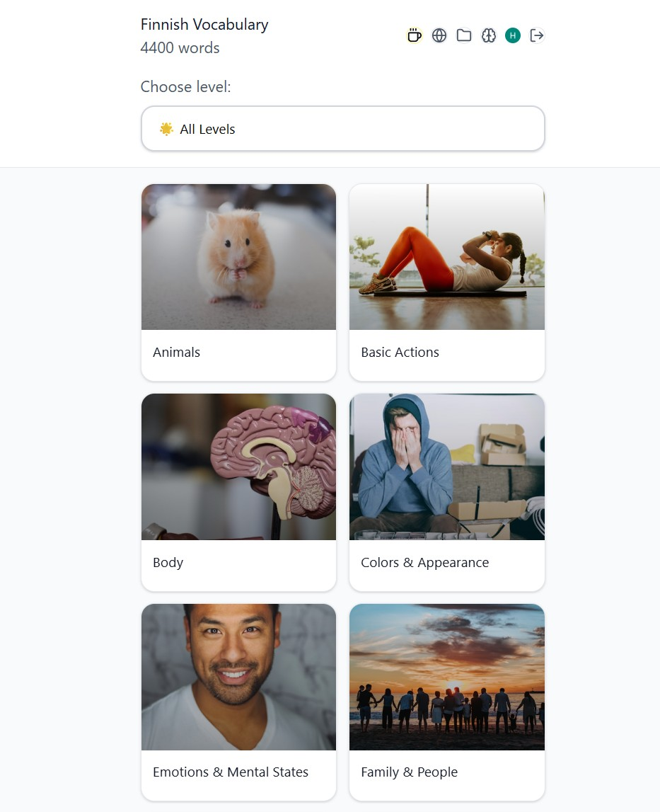
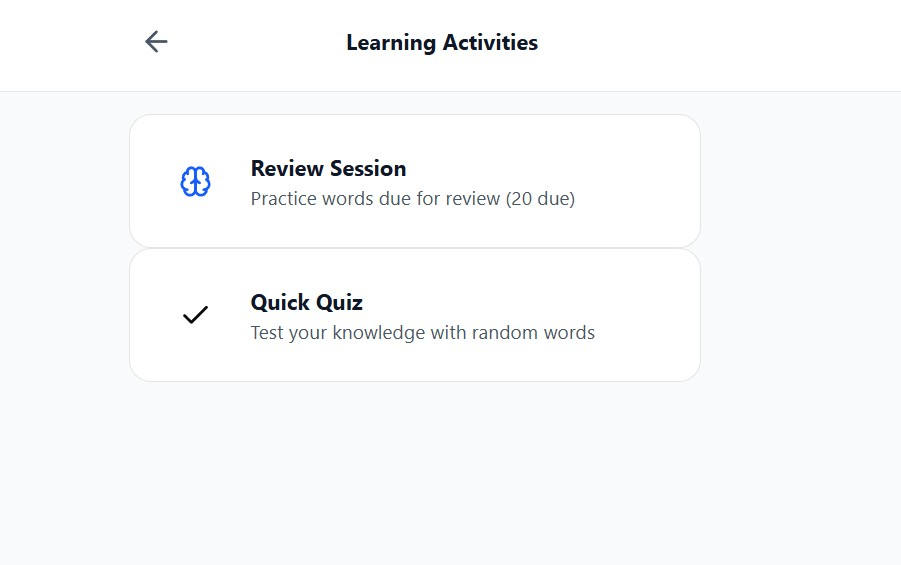
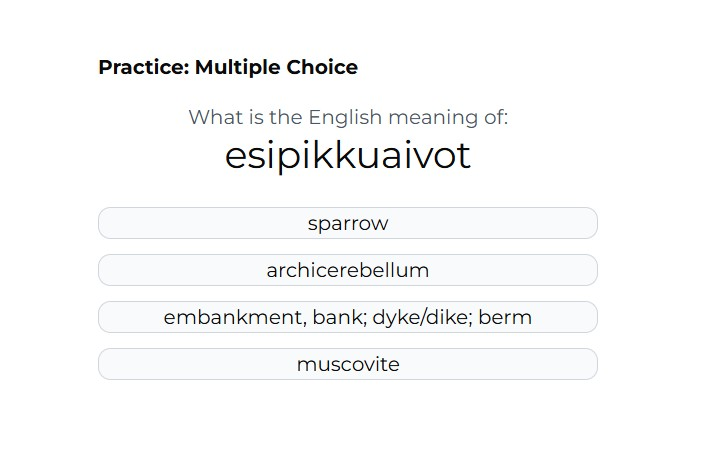
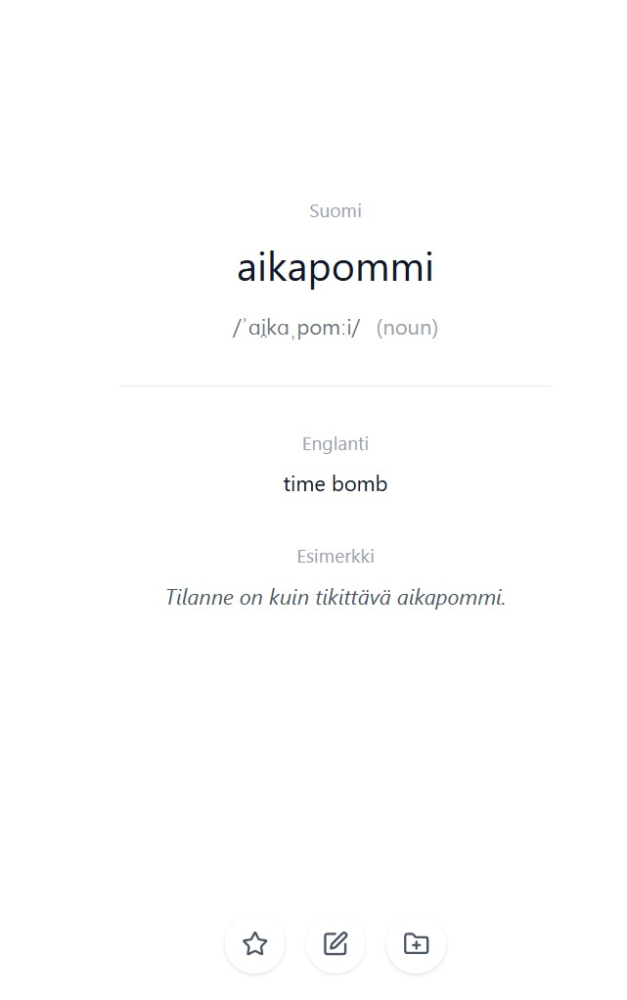

# Finnish Vocabulary Learning App

[](https://reactjs.org/)
[](https://www.typescriptlang.org/)
[](https://vitejs.dev/)
[](https://firebase.google.com/)
[](https://tailwindcss.com/)
[](LICENSE)

A modern React-based app for learning Finnish vocabulary with spaced repetition, Firebase integration, and bilingual support.

## Table of Contents

- [Demo](#demo)
- [Features](#features)
- [How to Use](#how-to-use)
- [Architecture](#architecture)
- [Project Structure](#project-structure)
- [Data Pipeline](#data-pipeline)
- [Categories](#categories)
- [Data Schema & Customization](#data-schema--customization)
- [User Experience](#user-experience)
- [Development](#development)
- [Deployment](#deployment)
- [Future Improvements](#future-improvements)
- [Getting Started](#getting-started)
- [Contributing](CONTRIBUTING.md)
- [Testing](#testing)
- [License](#license)

## Demo

Check out the app in action:

[](https://www.youtube.com/watch?v=Bcwf0F4_alA)

_Click the image above to watch the demo video_

[↑ Back to Top](#table-of-contents)

---

## Screenshots

| Home Screen                                                    | Categories View                                                          |
| -------------------------------------------------------------- | ------------------------------------------------------------------------ |
|  |  |

| Learning Activities                                                                                                                                                                                                          | Sample Vocabulary Card                                                                                               |
| ---------------------------------------------------------------------------------------------------------------------------------------------------------------------------------------------------------------------------- | -------------------------------------------------------------------------------------------------------------------- |
| <br>**Learning Activities**<br><br><br>**Learning Activities 2** | <br>**Sample Vocabulary Card** |

[↑ Back to Top](#table-of-contents)

---

## Getting Started

### Prerequisites

- Node.js (version 18 or higher)
- npm or yarn
- Firebase project with Firestore and Authentication enabled

### Installation

<details>
<summary>📦 Click to view detailed installation steps</summary>

1. Clone the repository:

   ```bash
   git clone https://github.com/Janphan/Finnish-Vocabulary-Learning-App.git
   cd finnish-vocabulary-learning-app
   ```

2. Install dependencies:

   ```bash
   npm install
   ```

3. Set up Firebase:

   - Create a Firebase project at https://console.firebase.google.com/
   - Enable Firestore and Authentication (Google Sign-In)
   - Rename `.env.example` to `.env` and fill in your Firebase credentials

4. Seed the Database (Important):
   Populate your empty Firestore project with the sample data:

   ```bash
   npm run seed:demo
   ```

5. Start the development server:
   ```bash
   npm run dev
   ```

The app will be available at `http://localhost:5173`.

</details>

[↑ Back to Top](#table-of-contents)

---

## Features

- **Bilingual Learning**: Finnish ↔ English vocabulary with contextual examples
- **Category-Based Organization**: Learn by semantic topics (Family, Food, Travel) and grammar categories (Nouns, Verbs, etc.)
- **Spaced Repetition System**: Basic review scheduling for vocabulary retention
- **Smart Vocabulary Cards**: Swipeable cards with pronunciation guides and part-of-speech information
- **User Authentication**: Google Sign-In for personalized learning
- **Favorites & Folders**: Save and organize personal vocabulary collections
- **Admin Vocabulary Management**: Edit and manage vocabulary database (admin only)
- **Responsive Design**: Works seamlessly on desktop and mobile devices
- **Firebase Integration**: Real-time data sync and user authentication

[↑ Back to Top](#table-of-contents)

---

## How to Use

### Basic Navigation

- **👆 Swipe Right** or **👈 Swipe Left** on vocabulary cards to navigate between words
- **⌨️ Keyboard**: Use arrow keys (← →) for navigation on desktop
- **🌐 Language Toggle**: Click the globe icon to switch between English and Finnish interface

### Learning Interactions

- **⭐ Favorites**: Click the star icon to save important words to your personal collection
- **Folders**: Create custom folders to organize your saved vocabulary
- **Examples**: View contextual Finnish sentences for better understanding

### Learning Modes

- **Practice Mode**: Random vocabulary selection to test your knowledge
- **Category Learning**: Browse and learn by semantic topics or grammar categories
- **Review Sessions**: Spaced repetition for vocabulary retention
- **Practice Quiz**: Interactive quiz to reinforce learning

### Account Features

- **Sign In**: Use Google authentication for personalized learning
- **Cross-Device Sync**: Your favorites and folders sync across all your devices
- **Admin Access**: Manage vocabulary database (admin users only)

[↑ Back to Top](#table-of-contents)

---

## Architecture

<details>
<summary>🏗️ Click to view technical architecture and decisions</summary>

- **Frontend**: React 18 + TypeScript + Vite
- **Styling**: Tailwind CSS with custom animations and Montserrat font
- **Backend**: Firebase Firestore for data storage and user management
- **Authentication**: Firebase Auth with Google Sign-In
- **State Management**: React hooks and context for user authentication
- **Admin Features**: Role-based access for vocabulary management
- **Testing**: Vitest for unit tests and component testing

### Technical Decisions

**Evolution:** JSON files → Firebase Firestore

**Benefits of Firebase:**

- **User accounts** - Google authentication and personalized learning
- **Cross-device sync** - Favorites and folders sync across devices
- **Real-time updates** - Live data synchronization
- **Scalable** - Handles thousands of users without performance issues
- **Offline-ready** - localStorage caching for offline vocabulary access
- **Admin-friendly** - Easy data updates without redeploying the app

</details>

[↑ Back to Top](#table-of-contents)

---

## Project Structure

<details>
<summary>📁 Click to expand/collapse the full project structure</summary>

```
src/
├── components/
│   ├── VocabularySwiper.tsx      # Main vocabulary display with SRS
│   ├── ReviewSession.tsx         # SRS review interface
│   ├── CategoryList.tsx          # Category navigation
│   ├── CategoriesView.tsx        # Categories overview
│   ├── FoldersView.tsx           # Folder management
│   ├── FolderView.tsx            # Individual folder view
│   ├── LearningView.tsx          # Learning interface
│   ├── PracticeView.tsx          # Practice interface
│   ├── ReviewView.tsx            # Review interface
│   ├── AddToFolderModal.tsx      # Add word to folder modal
│   ├── EditWordModal.tsx         # Edit word modal
│   ├── FolderManager.tsx         # Folder management component
│   └── figma/
│       └── ImageWithFallback.tsx # Image component with fallback
├── contexts/
│   └── AuthContext.tsx           # Authentication context
├── hooks/
│   ├── useAIVocabulary.ts        # AI-powered vocabulary generation
│   ├── useApiVocabulary.ts       # API vocabulary hook
│   ├── useApiVocabulary.test.ts  # Tests for API vocabulary hook
│   └── useFirestoreVocabulary.ts # Firebase data fetching with caching
├── PracticeGame/
│   └── PracticeQuiz.tsx          # Random practice quiz
├── services/
│   ├── aiService.ts              # AI processing service
│   ├── categoryService.ts        # Category management
│   ├── firebaseAuth.ts           # Firebase authentication
│   ├── firebaseConfig.ts         # Firebase configuration
│   ├── firebaseVocabulary.ts     # Firebase vocabulary operations
│   ├── firestore.ts              # Firestore utilities
│   ├── userService.ts            # User management
│   └── vocabularyService.ts      # Vocabulary service
├── types/
│   └── index.ts                  # TypeScript type definitions
├── utils/
│   ├── fallbackExamples.ts       # Fallback examples utility
│   ├── promptUtils.ts            # Prompt utilities
│   ├── session.ts                # Session management
│   ├── srsLogic.test.ts          # SRS logic unit tests
│   ├── srsLogic.ts               # SRS algorithm logic
│   └── translations.ts           # Translation utilities
├── App.tsx                       # Main app component
├── firebase.ts                   # Firebase initialization
├── index.css                     # Global styles
├── main.tsx                      # Entry point
└── vite-env.d.ts                 # Vite environment types

public/
├── (empty - data stored in Firebase)

scripts/
├── (empty - one-time setup scripts removed after use)
```

</details>

[↑ Back to Top](#table-of-contents)

---

## Data Pipeline

<details>
<summary>📊 Click to view data strategy and schema</summary>

**Strategy: Code Public, Data Private** - The app ships with demo data for immediate use.

**Disclaimer:** The repository contains the scripts used to clean and process raw dictionary data (scripts/extract-vocabulary.js). You can use these scripts to process your own dictionary dumps (e.g., from Kaikki.org) by placing your raw file in the data/ folder.

**Demo Data Included:**

- **20 sample vocabulary words** covering various categories and difficulty levels
- **Complete data schema** documented below for custom data uploads
- **Ready-to-use examples** with Finnish sentences

**Data Schema for Custom Vocabulary:**

Please refer to the Data Schema & Customization section below for the complete JSON structure and validation rules.

**Adding Your Own Data:**

1. Create a JSON file following the schema above
2. Upload to Firebase Firestore under the `vocabulary` collection
3. Update categories in the `categories` collection if needed
4. The app will automatically load your custom vocabulary

**Sample Data Structure:**
See `docs/sample-data.json` in the repository for complete examples of properly formatted vocabulary entries.

</details>

[↑ Back to Top](#table-of-contents)

---

## Categories

**Demo Data Categories:**

The sample data includes vocabulary from these categories:

- **Animals** (koira, kissa, lehmä)
- **Home** (talo)
- **Transport** (auto)
- **Food** (syödä, juoda, vesi)
- **Family** (äiti, isä)
- **Education** (kirja, koulu, opiskella)
- **People** (ystävä)
- **Descriptions** (iso, pieni, kaunis)
- **Actions** (lentää)
- **Travel** (matka)
- **Emotions** (rakastaa)

**Difficulty Levels:**

- **Beginner**: Basic vocabulary (14 words)
- **Intermediate**: More advanced terms (6 words)

**Total Demo Words**: 20 vocabulary entries with example sentences

<details>
<summary>📚 Click to view data schema for custom categories</summary>

**Category Document Structure:**

```json
{
  "id": "string", // Unique category identifier
  "name": "string", // Display name (e.g., "Family & People")
  "count": "number", // Number of words in category
  "emoji": "string", // Category emoji
  "description": "string" // Optional description
}
```

**Adding Custom Categories:**

1. Create category documents in Firestore `categories` collection
2. Reference category IDs in vocabulary `categoryId` fields
3. The app will automatically display your custom categories

</details>

[↑ Back to Top](#table-of-contents)

---

## Data Schema & Customization

<details>
<summary>🔧 Click to view data schema and customization options</summary>

**Complete Vocabulary Schema:**

```json
{
  "id": "string", // Unique identifier (required)
  "finnish": "string", // Finnish word (required)
  "english": "string", // English translation (required)
  "partOfSpeech": "string", // "noun", "verb", "adjective", etc. (optional)
  "difficulty": "string", // "beginner", "intermediate", "advanced" (required)
  "categoryId": "string", // Category identifier (required)
  "examples": ["string"] // Array of example sentences (optional)
}
```

**Uploading Custom Data:**

1. **Prepare your data** as JSON array following the schema above
2. **Create Firebase project** and enable Firestore
3. **Upload to Firestore** under the `vocabulary` collection
4. **Add categories** to the `categories` collection if needed
5. **Configure environment** with your Firebase credentials

**Data Validation:**

- All vocabulary entries must have `id`, `finnish`, `english`, `difficulty`, and `categoryId`
- Example sentences should be natural Finnish phrases using the vocabulary word
- Category IDs should match documents in your `categories` collection

**Sample Implementation:**
See `sample-data.json` for 20 complete examples with proper formatting and realistic example sentences.

</details>

[↑ Back to Top](#table-of-contents)

---

## User Experience

**Bilingual Learning Interface:**

- **Language Toggle** - Switch between English and Finnish with Globe icon
- **Adaptive UI** - All interface elements translate automatically
- **Category Names** - Both semantic and grammar categories show in selected language

**Enhanced Vocabulary Cards:**

- **Pronunciation Guide** - IPA notation with audio icon
- **Part of Speech** - Grammar context in parentheses (noun, verb, adjective, etc.)
- **Smart Navigation** - Random vocabulary selection prevents repetition
- **Keyboard Support** - Arrow keys for navigation
- **Touch Gestures** - Swipe left/right on mobile

**Learning Features:**

- **Favorites System** - Save important words
- **Folder Organization** - Create custom collections
- **Progress Tracking** - Word count indicators
- **Contextual Examples** - Real Finnish sentences

[↑ Back to Top](#table-of-contents)

---

## Development

<details>
<summary>🛠️ Click to view development setup and customization options</summary>

**Data Management Scripts:**

```bash
# Upload demo data (20 sample words)
npm run seed:demo

# Upload full production data (requires production-data.json)
npm run admin:upload-full
```

**Firebase Setup:**

1. Create a Firebase project at [Firebase Console](https://console.firebase.google.com/).
2. Enable **Firestore** and **Authentication** (Google Sign-In).
3. Rename `.env.example` to `.env` and fill in your credentials.
4. Run one of the data seeding scripts above.

**Custom Vocabulary Upload:**

1. **Prepare your data** as JSON array following the documented schema
2. **Save as `production-data.json`** in the root directory (add to .gitignore!)
3. **Run** `npm run admin:upload-full` to upload to Firestore
4. **Categories** are automatically created from your data

**Modify categories:**

1. Update category IDs in your vocabulary data
2. Update emoji mappings in `src/hooks/useFirestoreVocabulary.ts` and `CategoryList.tsx`

**Custom examples:**

- The app uses example sentences from your vocabulary data
- Add contextual Finnish phrases to the `examples` array in your data

</details>

[↑ Back to Top](#table-of-contents)

---

## Deployment

<details>
<summary>🚀 Click to view deployment instructions and configurations</summary>

**For Vercel/GitHub Pages:**

1. **Set environment variables:**

   - `VITE_FIREBASE_API_KEY`
   - `VITE_FIREBASE_AUTH_DOMAIN`
   - `VITE_FIREBASE_PROJECT_ID`
   - `VITE_FIREBASE_STORAGE_BUCKET`
   - `VITE_FIREBASE_MESSAGING_SENDER_ID`
   - `VITE_FIREBASE_APP_ID`
   - `VITE_FIREBASE_MEASUREMENT_ID`

2. **Build and deploy:**

```bash
npm run build
npm run deploy  # For GitHub Pages
```

**For other platforms:**

- Copy `.env` variables to your hosting platform's environment settings
- Deploy the `build/` folder as static files

</details>

[↑ Back to Top](#table-of-contents)

---

## Future Improvements

<details>
<summary>🚀 Click to explore planned features and roadmap</summary>

**Learning Experience:**

- **Audio Pronunciation** - Native Finnish speaker recordings for all vocabulary
- **Gamification** - Points, streaks, achievements, and leaderboards
- **Advanced Analytics** - Learning curves, retention rates, and weak points identification
- **AI-Powered Recommendations** - Personalized word suggestions based on learning patterns
- **Conjugation Practice** - Interactive verb and noun inflection exercises

**Mobile & Accessibility:**

- **Progressive Web App** - Installable mobile app with offline functionality
- **Dark Mode** - Eye-friendly interface for evening study sessions
- **Accessibility** - Screen reader support and keyboard navigation improvements
- **Native Mobile App** - iOS and Android apps with push notifications

**Content & Features:**

- **Conversational Finnish** - Common phrases and dialogue practice
- **Cultural Context** - Finnish customs, history, and cultural notes
- **Reading Comprehension** - Short Finnish stories and articles
- **Multiple Languages** - Expand beyond English to support other native languages
- **Community Features** - User-generated content and shared learning paths

**Technical Enhancements:**

- **Performance Optimization** - Faster loading and smoother animations
- **Advanced Search** - Full-text search across all vocabulary and examples
- **Export/Import** - Personal vocabulary lists and progress backup
- **Sync with Language Tools** - Integration with Anki, Quizlet, or language learning platforms

</details>

[↑ Back to Top](#table-of-contents)

---

## Testing

Run tests with:

```bash
npm test
```

[↑ Back to Top](#table-of-contents)

---

## License

MIT License - Feel free to use for learning Finnish!

[↑ Back to Top](#table-of-contents)

---
